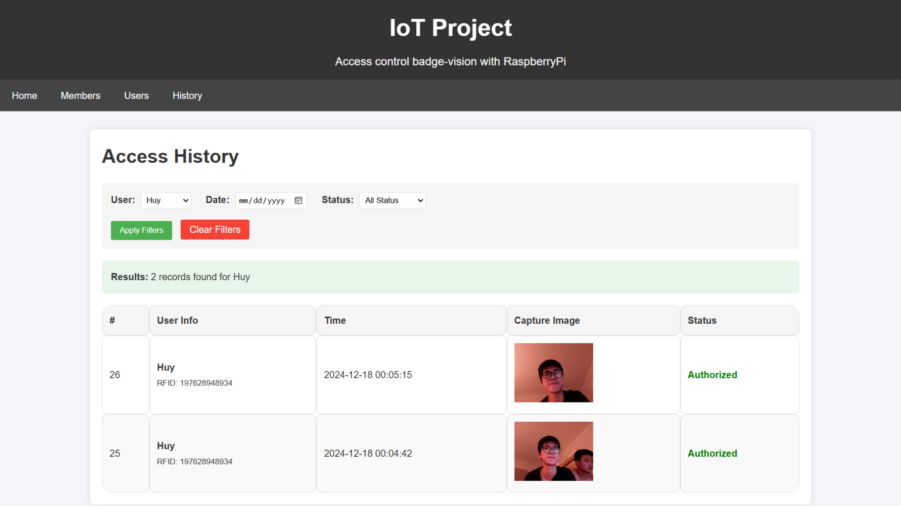

# IoT Project: Facial Recognition Integrated Badge System

This Internet of Things (IoT) project was developed as part of the Final Year Studies at INSA Centre Val de Loire, specializing in Acquisition, Analysis, and Decision (ACAD).

Our goal is to develop a system for NFC/RFID badge detection integrated with facial recognition using a Raspberry Pi 3, a Pi Camera, and a badge reader as hardware peripherals. The system implements two-layer authentication:

1. **Badge authentication** – The system verifies the badge information against an internal database.
2. **Facial recognition** – If the badge is valid, the system captures the user's face and compares it with stored facial patterns for verification.

## How It Works

The diagram above illustrates the step-by-step verification process:

1. The badge information is read and verified against the database.
2. If the information is valid, the system activates a low-resolution camera to capture the user’s face.
3. If the facial pattern matches the stored data (around 15–20 images per user), the system grants access and lights up a green LED.
4. If the badge information is invalid or the face is not recognized, the system denies access and lights up a red LED.

## System Interconnection

The following diagram shows the general connection between the hardware components of our IoT project:  

We use a Flask API to host a web server that communicates via a Wi-Fi network and HTTP for processing requests and responses from the manager. The system follows a **Model-View-Controller (MVC)** architecture, developed using HTML, CSS, and Flask for a responsive user interface.

Each time an access attempt is made (authorized or not), the system records the user’s information and image in the database for tracking purposes.

## Database Management

We developed a web interface using HTML and CSS for monitoring and managing access records and user information.

- The attendance page displays recent access history, including the user’s name, badge ID, access date, and access status.  
  

- Another page allows administrators to manage user data, including adding or deleting badge IDs and user information. The system also supports automatic badge registration via the NFC/RFID reader.

## Facial Recognition

Based on this [Raspberry Pi facial recognition tutorial](https://www.tomshardware.com/how-to/raspberry-pi-facial-recognition), we adapted the solution to our use case.

- Each new user is required to provide multiple facial images from different angles.
- The images are processed, trained, and stored using the **cv2**, **face_recognition**, and **pickle** libraries.
- During badge scanning, the camera captures an image and matches the face with the stored data before logging the result in the access history.

## Future Improvements

- Implement enhanced security by establishing administrator-only access for database management.
- Integrate a faster and more efficient visual recognition model (e.g., YOLO).
- Improve the camera's speed and responsiveness.

---

Team members: _Huy NGUYEN, Quoc Cuong NGUYEN, Khoa VU, Quoc Tan NGUYEN, Van Hieu HA_  
Copyright INSA Centre Val de Loire 2024-2025
